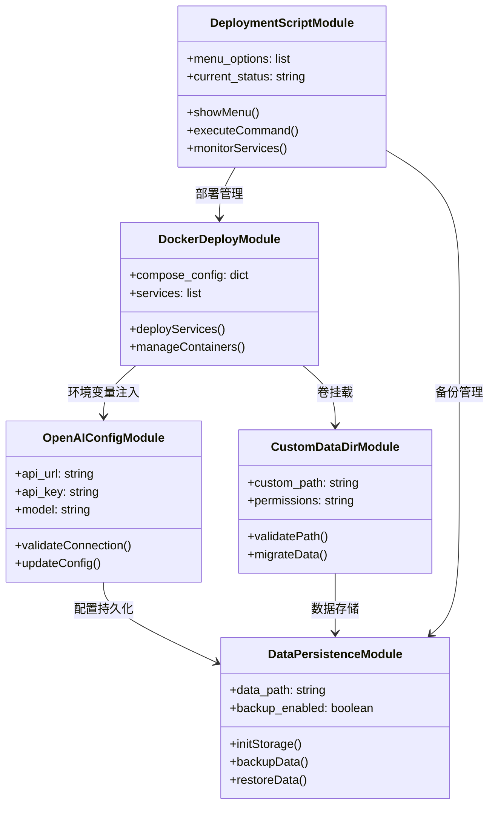
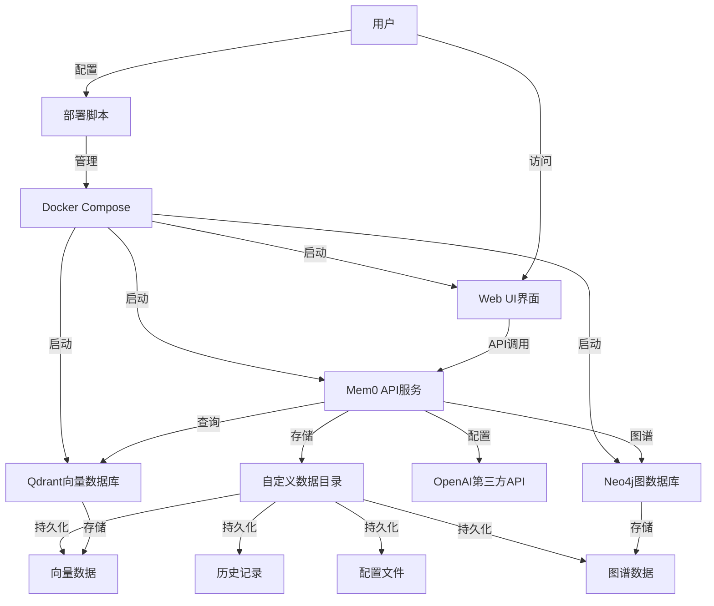
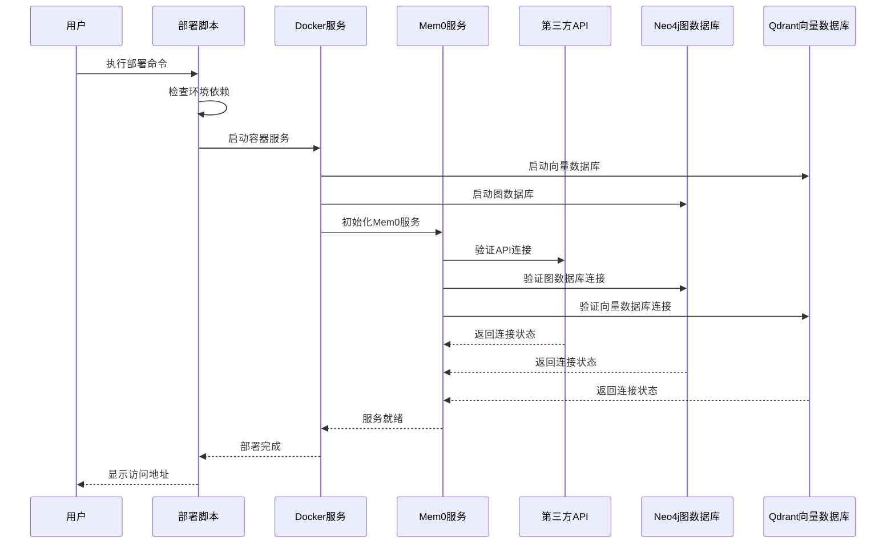

# 技术方案设计文档：Mem0二次开发增强方案

## 文档信息
- 作者：AI Assistant
- 版本：v1.0
- 日期：2025-01-26
- 状态：草稿
- 架构类型：非GBF框架 - 版本：基于Mem0 v0.1.114

# 一、名词解释

| 术语 | 解释 |
|------|------|
| Mem0 | 开源AI记忆层系统，为AI助手提供智能持久化记忆能力 |
| OpenAI第三方API | 兼容OpenAI API格式的第三方服务提供商，如DeepSeek、智谱AI等 |
| 自定义API_URL | 用户可配置的第三方API服务端点地址 |
| 数据持久化 | 将记忆数据、配置信息等永久保存到存储介质中 |
| 自定义数据目录 | 用户可指定的数据存储路径，便于数据管理和备份 |
| 一键部署脚本 | 自动化部署和管理工具，提供交互式菜单操作 |
| Docker容器化 | 使用Docker技术实现应用的容器化部署和管理 |
| 向量数据库 | 存储和检索向量嵌入的专用数据库，如Qdrant |
| LLM配置 | 大语言模型的配置参数，包括API密钥、模型名称等 |

# 二、功能模块

## 核心功能

### 1. OpenAI第三方API支持模块
- **功能描述**：支持用户配置自定义的OpenAI兼容API服务
- **核心属性**：
  - 自定义API_URL配置
  - API密钥管理
  - 模型参数配置
  - 连接验证机制

### 2. 数据持久化管理模块
- **功能描述**：提供完整的数据持久化解决方案
- **核心属性**：
  - 向量数据存储
  - 历史记录管理
  - 配置文件持久化
  - 数据备份恢复

### 3. 自定义数据目录模块
- **功能描述**：允许用户指定数据存储路径
- **核心属性**：
  - 路径配置管理
  - 目录权限检查
  - 数据迁移支持
  - 存储空间监控

### 4. Docker部署管理模块
- **功能描述**：提供完整的容器化部署解决方案
- **核心属性**：
  - 容器编排配置
  - 服务依赖管理
  - 网络配置
  - 卷挂载管理

### 5. 一键部署脚本模块
- **功能描述**：提供交互式部署和管理工具
- **核心属性**：
  - 菜单驱动界面
  - 自动化部署流程
  - 服务状态监控
  - 日志管理功能

## 功能模块关系



# 三、应用调用关系

## 系统架构图



## 时序图



# 四、详细方案设计

## 架构选型

本方案采用标准三层架构模式，结合Docker容器化技术，实现Mem0系统的二次开发增强。

### 分层架构说明

#### 标准分层架构（非GBF框架项目）
```
# 应用层（Application Layer）
- **部署脚本层**：提供交互式部署和管理界面
- **Web UI层**：基于Next.js的前端管理界面
- **API网关层**：FastAPI实现的RESTful API服务

# 业务逻辑层（Business Layer）
- **配置管理服务**：处理OpenAI API配置和验证
- **数据管理服务**：处理数据持久化和目录管理
- **部署管理服务**：处理Docker容器编排和服务管理

# 数据访问层（Data Access Layer）
- **向量存储层**：Qdrant向量数据库访问
- **文件存储层**：本地文件系统数据访问
- **配置存储层**：JSON/YAML配置文件管理
```

### 数据模型设计

#### 标准数据模型（非GBF框架项目）
```
# 配置数据模型（Config Model）
- OpenAIConfig：OpenAI API配置对象
- DataPathConfig：数据路径配置对象
- DeploymentConfig：部署配置对象

# 业务对象模型（Business Object）
- MemoryService：记忆服务业务对象
- ConfigService：配置服务业务对象
- DeploymentService：部署服务业务对象

# 持久化对象（Persistent Object）
- VectorData：向量数据持久化对象
- HistoryData：历史记录持久化对象
- ConfigData：配置数据持久化对象
```

## 应用1：OpenAI第三方API配置增强

### 业务流程1：环境变量配置

#### OpenAI环境变量配置

**配置说明**：通过环境变量实现OpenAI第三方API的配置，支持用户自定义API_URL和密钥配置

**环境变量列表**：
```bash
# OpenAI API配置
OPENAI_API_KEY=sk-xxx或第三方API密钥
OPENAI_BASE_URL=https://api.openai.com/v1  # 默认OpenAI，可改为第三方API
OPENAI_MODEL=gpt-4o-mini  # 默认模型
OPENAI_TEMPERATURE=0.1
OPENAI_MAX_TOKENS=2000

# 嵌入模型配置
OPENAI_EMBEDDING_MODEL=text-embedding-3-small  # 默认嵌入模型

# Neo4j图数据库配置
NEO4J_URL=bolt://neo4j:7687  # Neo4j连接地址
NEO4J_USERNAME=neo4j  # Neo4j用户名
NEO4J_PASSWORD=mem0graph  # Neo4j密码
NEO4J_DATABASE=neo4j  # 数据库名称

# 图存储配置
ENABLE_GRAPH_STORE=true  # 是否启用图存储
GRAPH_STORE_PROVIDER=neo4j  # 图存储提供商

# 兼容性配置（支持多种命名方式）
API_KEY=${OPENAI_API_KEY}
OPENAI_API_BASE=${OPENAI_BASE_URL}  # 向后兼容
```

**配置文件示例**：
```bash
# .env 文件示例 - 使用默认OpenAI
OPENAI_API_KEY=sk-1234567890abcdef
OPENAI_BASE_URL=https://api.openai.com/v1
OPENAI_MODEL=gpt-4o-mini
OPENAI_EMBEDDING_MODEL=text-embedding-3-small
OPENAI_TEMPERATURE=0.1
OPENAI_MAX_TOKENS=2000

# Neo4j图数据库配置
NEO4J_URL=bolt://neo4j:7687
NEO4J_USERNAME=neo4j
NEO4J_PASSWORD=mem0graph
ENABLE_GRAPH_STORE=true

# .env 文件示例 - 使用第三方API（如DeepSeek）
OPENAI_API_KEY=sk-deepseek-api-key
OPENAI_BASE_URL=https://api.deepseek.com/v1
OPENAI_MODEL=deepseek-chat
OPENAI_EMBEDDING_MODEL=text-embedding-3-small  # 仍使用OpenAI嵌入
OPENAI_TEMPERATURE=0.1
OPENAI_MAX_TOKENS=2000

# Neo4j图数据库配置（与第三方API配合使用）
NEO4J_URL=bolt://neo4j:7687
NEO4J_USERNAME=neo4j
NEO4J_PASSWORD=mem0graph
ENABLE_GRAPH_STORE=true
```

#### 配置改动点

**改动类型**：功能扩展 - 在现有OpenAI配置基础上增加第三方API支持

**详细改动内容**：
1. 扩展现有的OpenAI配置类，增加环境变量读取支持
2. 支持多种环境变量命名方式的兼容性
3. 添加Neo4j图数据库配置支持
4. 添加配置验证和默认值处理
5. 实现配置的动态加载机制

#### 代码分层设计

##### 标准分层设计（非GBF框架项目）

```
# 配置层（Configuration Layer）
- 职责：环境变量读取和配置管理
- 代码位置：mem0/configs/llms/base.py
- 设计要点：
  - 环境变量优先级处理
  - 默认值和验证规则
  - 配置兼容性处理

# 服务层（Service Layer）
- 职责：LLM服务初始化和配置应用
- 代码位置：mem0/llms/openai.py
- 设计要点：
  - 动态配置加载
  - 连接验证逻辑
  - 错误处理和降级

# 工厂层（Factory Layer）
- 职责：根据配置创建LLM实例
- 代码位置：mem0/utils/factory.py
- 设计要点：
  - 配置驱动的实例创建
  - 多提供商支持
  - 实例缓存和复用
```

#### 代码改动点

**详述需要改动的代码，重点说明实现思路**：

1. **扩展LLM配置基类**：
   - 修改 `mem0/configs/llms/base.py` 中的 `BaseLlmConfig` 类
   - 增加环境变量读取逻辑，支持 `OPENAI_BASE_URL`、`OPENAI_MODEL` 等
   - 设置默认值：`model="gpt-4o-mini"`，`base_url="https://api.openai.com/v1"`
   - 实现配置优先级：环境变量 > 配置文件 > 默认值

2. **增强OpenAI LLM实现**：
   - 修改 `mem0/llms/openai.py` 中的 `OpenAILlm` 类
   - 支持从环境变量动态读取base_url配置
   - 默认使用 `gpt-4o-mini` 模型
   - 保持向后兼容性，支持 `OPENAI_API_BASE` 等旧环境变量

3. **增强嵌入模型配置**：
   - 修改 `mem0/embeddings/openai.py` 中的 `OpenAIEmbedding` 类
   - 支持 `OPENAI_EMBEDDING_MODEL` 环境变量
   - 默认使用 `text-embedding-3-small` 模型
   - 保持嵌入维度配置的灵活性

4. **新增Neo4j图数据库配置**：
   - 修改 `mem0/configs/base.py` 中的 `GraphStoreConfig` 类
   - 支持 `NEO4J_URL`、`NEO4J_USERNAME`、`NEO4J_PASSWORD` 环境变量
   - 实现图存储的启用/禁用控制
   - 添加Neo4j连接验证和错误处理

5. **优化配置加载机制**：
   - 在应用启动时读取环境变量
   - 实现配置验证和错误提示
   - 支持配置的运行时检查
   - 提供模型兼容性检查
   - 添加图数据库连接检查

6. **环境变量文档化**：
   - 创建 `.env.example` 模板文件，包含默认模型和图数据库配置
   - 在部署脚本中提供配置向导
   - 添加模型选择和图数据库配置功能

## 应用2：数据持久化和自定义目录

### 业务流程2：环境变量数据目录配置

#### 数据目录环境变量配置

**配置说明**：通过环境变量配置自定义数据存储目录，支持Docker卷挂载和权限管理

**环境变量列表**：
```bash
# 数据目录配置
MEM0_DATA_PATH=/opt/mem0_data
MEM0_HISTORY_DB_PATH=${MEM0_DATA_PATH}/history.db
MEM0_VECTOR_STORAGE_PATH=${MEM0_DATA_PATH}/vector_storage
MEM0_CONFIG_PATH=${MEM0_DATA_PATH}/config

# Qdrant配置
QDRANT_STORAGE_PATH=${MEM0_DATA_PATH}/qdrant
QDRANT_HOST=qdrant
QDRANT_PORT=6333

# Neo4j图数据库配置
NEO4J_STORAGE_PATH=${MEM0_DATA_PATH}/neo4j
NEO4J_HOST=neo4j
NEO4J_HTTP_PORT=7474
NEO4J_BOLT_PORT=7687

# 备份配置
MEM0_BACKUP_ENABLED=true
MEM0_BACKUP_PATH=${MEM0_DATA_PATH}/backups
```

**Docker Compose配置示例**：
```yaml
services:
  mem0-api:
    environment:
      - MEM0_DATA_PATH=/app/data
      - NEO4J_URL=bolt://neo4j:7687
      - NEO4J_USERNAME=neo4j
      - NEO4J_PASSWORD=mem0graph
      - ENABLE_GRAPH_STORE=true
    volumes:
      - ${MEM0_DATA_PATH:-./data}:/app/data
    depends_on:
      - qdrant
      - neo4j

  qdrant:
    volumes:
      - ${MEM0_DATA_PATH:-./data}/qdrant:/qdrant/storage

  neo4j:
    image: neo4j:5.26.4
    environment:
      - NEO4J_AUTH=neo4j/mem0graph
      - NEO4J_PLUGINS=["apoc"]
    volumes:
      - ${MEM0_DATA_PATH:-./data}/neo4j:/data
    ports:
      - "7474:7474"  # HTTP
      - "7687:7687"  # Bolt
```

#### 配置改动点

**改动类型**：新增功能 - 添加环境变量驱动的数据目录管理

**详细改动内容**：
1. 新增环境变量读取和路径配置
2. 实现Docker卷挂载配置，包括Neo4j数据卷
3. 添加目录自动创建和权限检查
4. 提供数据路径的统一管理
5. 集成Neo4j图数据库的数据持久化

#### 代码分层设计

```
# 配置层改动
- 扩展基础配置类，支持数据路径环境变量
- 实现路径验证和默认值处理
- 添加路径规范化和安全检查

# 存储层改动
- 修改向量存储初始化逻辑
- 更新历史数据库路径配置
- 实现存储路径的动态配置

# 部署层改动
- 优化Docker卷挂载配置
- 实现数据目录的自动创建
- 添加权限和空间检查
```

#### 代码改动点

1. **扩展基础配置**：
   - 修改 `mem0/configs/base.py` 中的 `MemoryConfig` 类
   - 增加环境变量读取：`MEM0_DATA_PATH`、`MEM0_HISTORY_DB_PATH` 等
   - 实现路径验证和规范化逻辑

2. **更新存储初始化**：
   - 修改向量存储和历史存储的初始化逻辑
   - 支持从环境变量读取存储路径
   - 添加目录自动创建功能

3. **优化Docker配置**：
   - 更新docker-compose.yml配置
   - 实现灵活的卷挂载配置
   - 添加数据持久化保证

## 应用3：Docker部署管理

### 业务流程3：容器化部署

#### Docker部署配置

**功能说明**：提供完整的Docker容器化部署解决方案，支持服务编排和依赖管理

**核心组件**：
- Mem0 API服务容器
- Qdrant向量数据库容器
- Neo4j图数据库容器
- Web UI前端容器
- 数据卷管理

**部署配置文件**：
```yaml
# docker-compose.prod.yml
version: '3.8'
services:
  mem0-api:
    build:
      context: .
      dockerfile: Dockerfile.prod
    environment:
      - OPENAI_API_KEY=${OPENAI_API_KEY}
      - OPENAI_BASE_URL=${OPENAI_BASE_URL}
      - DATA_PATH=${DATA_PATH:-/app/data}
    volumes:
      - ${DATA_PATH:-./data}:/app/data
      - ./config:/app/config
    ports:
      - "${API_PORT:-8000}:8000"
    depends_on:
      - qdrant
      - neo4j

  qdrant:
    image: qdrant/qdrant:latest
    volumes:
      - ${DATA_PATH:-./data}/qdrant:/qdrant/storage
    ports:
      - "${QDRANT_PORT:-6333}:6333"

  neo4j:
    image: neo4j:5.26.4
    environment:
      - NEO4J_AUTH=neo4j/mem0graph
      - NEO4J_PLUGINS=["apoc"]
      - NEO4J_apoc_export_file_enabled=true
      - NEO4J_apoc_import_file_enabled=true
    volumes:
      - ${DATA_PATH:-./data}/neo4j:/data
    ports:
      - "${NEO4J_HTTP_PORT:-7474}:7474"  # HTTP
      - "${NEO4J_BOLT_PORT:-7687}:7687"  # Bolt

  web-ui:
    build:
      context: ./ui
      dockerfile: Dockerfile
    environment:
      - NEXT_PUBLIC_API_URL=http://localhost:${API_PORT:-8000}
    ports:
      - "${UI_PORT:-3000}:3000"
    depends_on:
      - mem0-api
```

#### 代码改动点

1. **创建生产环境Dockerfile**：
   - 新增 `Dockerfile.prod` 优化生产部署
   - 多阶段构建减少镜像大小
   - 安全配置和权限管理

2. **增强docker-compose配置**：
   - 创建生产环境compose文件
   - 添加健康检查和重启策略
   - 实现服务依赖管理

3. **新增环境变量管理**：
   - 创建 `.env.example` 模板文件
   - 实现环境变量验证
   - 提供默认值和文档说明

## 应用4：一键部署脚本

### 业务流程4：自动化部署管理

#### 部署脚本功能

**脚本名称**：`deploy.sh`

**功能描述**：提供交互式菜单驱动的部署和管理工具

**菜单结构**：
```bash
=== Mem0 部署管理工具 ===
1. Docker部署（推荐）
   ├── 1) 完整模式部署Mem0
   ├── 2) 重新构建服务
   └── 3) 更新配置

2. Mem0服务管理
   ├── 1) 停止服务
   ├── 2) 重启服务
   ├── 3) 查看服务状态
   ├── 4) 查看日志
   │   ├── 1) 实时日志查看
   │   ├── 2) 历史日志查看
   │   ├── 3) 日志分析和导出
   │   └── 4) 日志清理
   └── 5) 性能监控

3. Mem0系统管理
   ├── 1) 系统清理
   ├── 2) 磁盘空间分析
   ├── 3) 健康检查
   ├── 4) 备份管理
   ├── 5) 系统时间同步
   └── 6) 检查容器时间

4. 系统命令帮助
```

#### 脚本实现要点

1. **环境检查和依赖验证**：
   - Docker和Docker Compose版本检查
   - 系统权限和端口可用性验证
   - 必要工具的安装检查

2. **交互式配置向导**：
   - OpenAI API环境变量配置引导
   - 数据目录环境变量设置
   - 端口配置和冲突检测
   - .env文件自动生成

3. **服务状态监控**：
   - 容器运行状态检查
   - 服务健康状态监控
   - 资源使用情况统计

4. **日志管理功能**：
   - 实时日志流显示
   - 日志文件轮转和清理
   - 错误日志分析和报告

#### 代码改动点

1. **创建部署脚本**：
   - 新增 `scripts/deploy.sh` 主部署脚本
   - 实现模块化功能函数
   - 添加错误处理和回滚机制

2. **配置管理脚本**：
   - 创建 `scripts/config_manager.sh`
   - 实现配置文件生成和验证
   - 提供配置备份和恢复

3. **服务监控脚本**：
   - 新增 `scripts/monitor.sh`
   - 实现服务状态检查
   - 添加性能监控和报警

## 配置文件变更

### 环境变量模板文件

#### 文件名：.env.example
```bash
# OpenAI API配置
OPENAI_API_KEY=sk-your-api-key-here
OPENAI_BASE_URL=https://api.openai.com/v1
OPENAI_MODEL=gpt-4o-mini  # 默认LLM模型
OPENAI_EMBEDDING_MODEL=text-embedding-3-small  # 默认嵌入模型
OPENAI_TEMPERATURE=0.1
OPENAI_MAX_TOKENS=2000

# 第三方API示例配置（可选）
# OPENAI_BASE_URL=https://api.deepseek.com/v1
# OPENAI_MODEL=deepseek-chat

# 数据存储配置
MEM0_DATA_PATH=./data
MEM0_HISTORY_DB_PATH=${MEM0_DATA_PATH}/history.db
MEM0_VECTOR_STORAGE_PATH=${MEM0_DATA_PATH}/vector_storage

# Qdrant配置
QDRANT_HOST=qdrant
QDRANT_PORT=6333
QDRANT_STORAGE_PATH=${MEM0_DATA_PATH}/qdrant

# Neo4j图数据库配置
NEO4J_URL=bolt://neo4j:7687
NEO4J_USERNAME=neo4j
NEO4J_PASSWORD=mem0graph
NEO4J_DATABASE=neo4j
ENABLE_GRAPH_STORE=true
NEO4J_STORAGE_PATH=${MEM0_DATA_PATH}/neo4j

# 服务端口配置
API_PORT=8000
UI_PORT=3000
QDRANT_PORT=6333
NEO4J_HTTP_PORT=7474
NEO4J_BOLT_PORT=7687
```

### Docker环境变量配置
- 在docker-compose.yml中引用环境变量
- 支持.env文件自动加载
- 提供默认值和验证机制

## 环境变量文档变更

### 新增环境变量：OpenAI配置
- 变量名：OPENAI_BASE_URL, OPENAI_MODEL, OPENAI_EMBEDDING_MODEL, OPENAI_TEMPERATURE, OPENAI_MAX_TOKENS
- 默认值：OPENAI_MODEL=gpt-4o-mini, OPENAI_EMBEDDING_MODEL=text-embedding-3-small
- 变更类型：新增
- 变更说明：支持OpenAI第三方API的环境变量配置，提供合理的默认模型

### 新增环境变量：数据目录配置
- 变量名：MEM0_DATA_PATH, MEM0_HISTORY_DB_PATH, MEM0_VECTOR_STORAGE_PATH
- 变更类型：新增
- 变更说明：支持自定义数据目录的环境变量配置

### 新增环境变量：Neo4j图数据库配置
- 变量名：NEO4J_URL, NEO4J_USERNAME, NEO4J_PASSWORD, ENABLE_GRAPH_STORE
- 默认值：NEO4J_URL=bolt://neo4j:7687, NEO4J_USERNAME=neo4j, NEO4J_PASSWORD=mem0graph
- 变更类型：新增
- 变更说明：支持Neo4j图数据库的环境变量配置，启用图谱关系功能

## 配置变更

### 配置类型：OpenAI模型配置
- 配置名：OPENAI_MODEL
- 配置值：gpt-4o-mini（默认）
- 说明：默认使用性价比最高的GPT-4o-mini模型

### 配置类型：嵌入模型配置
- 配置名：OPENAI_EMBEDDING_MODEL
- 配置值：text-embedding-3-small（默认）
- 说明：默认使用最新的小型嵌入模型，平衡性能和成本

### 配置类型：API端点配置
- 配置名：OPENAI_BASE_URL
- 配置值：https://api.openai.com/v1（默认）
- 说明：支持第三方OpenAI兼容API服务，如DeepSeek、智谱AI等

### 配置类型：数据路径配置
- 配置名：MEM0_DATA_PATH
- 配置值：用户指定的数据存储路径
- 说明：自定义数据存储目录路径

## 非功能性需求

### 性能需求
- API响应时间：< 200ms（配置查询）
- 数据迁移速度：> 100MB/s（本地存储）
- 并发支持：50个并发用户
- 容器启动时间：< 30秒

### 可用性需求
- 系统可用率：99.5%
- 故障恢复时间：< 5分钟
- 数据备份频率：每日自动备份
- 配置热更新：支持无重启配置更新

### 扩展性需求
- 支持水平扩展：多实例部署
- 插件化架构：支持第三方LLM提供商扩展
- 配置模板：支持预定义配置模板
- API版本管理：向后兼容的API版本策略

## 兼容性与平滑迁移方案

### 兼容性问题
1. **现有配置兼容**：保持与原有配置格式的兼容性
2. **API向后兼容**：新增API不影响现有功能
3. **数据格式兼容**：支持现有数据格式的自动迁移

### 平滑迁移方案
1. **配置迁移**：自动检测并迁移现有配置
2. **数据迁移**：提供数据迁移工具和验证机制
3. **服务升级**：支持滚动更新和零停机升级
4. **回滚机制**：提供快速回滚到上一版本的能力

## 风险与应对措施

| 风险 | 可能性 | 影响 | 应对措施 |
|------|-------|------|---------|
| 第三方API不稳定 | 中 | 中 | 实现重试机制和降级策略 |
| 数据迁移失败 | 低 | 高 | 提供完整备份和回滚机制 |
| Docker环境兼容性 | 低 | 中 | 多环境测试和兼容性检查 |
| 配置错误导致服务异常 | 中 | 中 | 配置验证和安全检查 |
| 存储空间不足 | 中 | 高 | 磁盘监控和自动清理机制 |

## 实施计划

### 第一阶段：基础功能开发（2周）
1. **OpenAI第三方API支持**
   - 扩展配置模型支持环境变量
   - 默认使用gpt-4o-mini和text-embedding-3-small模型
   - 实现多种API提供商兼容
   - 添加配置验证和错误处理

2. **数据目录自定义**
   - 实现环境变量驱动的路径配置
   - 开发Docker卷挂载配置
   - 添加目录自动创建和权限检查

### 第二阶段：部署工具开发（1.5周）
1. **Docker配置优化**
   - 创建生产环境Dockerfile
   - 优化docker-compose配置
   - 实现环境变量管理

2. **部署脚本开发**
   - 开发交互式部署脚本
   - 实现服务监控功能
   - 添加日志管理工具

### 第三阶段：测试和优化（0.5周）
1. **功能测试**
   - 单元测试和集成测试
   - 性能测试和压力测试
   - 兼容性测试

2. **文档完善**
   - 用户使用手册
   - 部署指南
   - 故障排除文档

## 总结

本技术方案通过对Mem0系统的二次开发，实现了以下核心增强功能：

1. **OpenAI第三方API支持**：通过环境变量配置自定义API端点和密钥，支持DeepSeek、智谱AI等第三方服务
2. **数据持久化增强**：通过环境变量配置自定义数据目录，支持Docker卷挂载和数据持久化
3. **Docker容器化部署**：提供完整的容器化部署方案，支持环境变量驱动的服务配置
4. **一键部署管理工具**：开发交互式部署脚本，提供环境变量配置向导和服务管理功能

该方案采用环境变量配置方式，避免了复杂的API接口开发，遵循Docker部署的最佳实践。通过最小粒度改动原则，在现有架构基础上进行扩展，确保与官方版本的兼容性，便于后续版本升级。为5人小团队提供了简单易用且功能完整的AI记忆系统解决方案。
