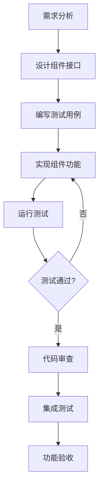

# OpenMemory-UI开发路径规划文档

## 1. 项目概述

### 1.1 项目背景
基于现有OpenMemory-UI的技术架构，将其从专门服务于OpenMemory的独立系统改造为服务于整个Mem0项目生态系统的统一管理界面。这是一个从单一服务到多服务集成的架构重构项目。

### 1.2 核心目标
- **服务范围扩展**：从仅管理OpenMemory扩展到管理整个Mem0生态系统
- **MCP深度集成**：将MCP服务的管理功能完整集成到UI中
- **API完全对齐**：确保前端API与实际Mem0 API完全一致
- **用户体验优化**：提供统一、直观的多服务管理界面

### 1.3 技术约束
- **最小化改动**：优先复用现有代码，避免重复开发
- **向后兼容**：保持对现有功能的兼容性
- **性能要求**：保持或提升系统性能
- **代码质量**：确保代码结构清晰，易于维护

## 2. 开发策略

### 2.1 MVP优先策略
采用最小可行产品(MVP) + 迭代扩展的开发策略，降低风险，快速验证核心功能。

```typescript
// 开发优先级矩阵
const developmentMatrix = {
  // 高优先级 + 高价值 = 立即开发
  immediate: [
    'Mem0 Memory CRUD操作',
    'API客户端重构',
    '基础配置管理',
    '简单仪表板'
  ],
  
  // 高优先级 + 中价值 = 第二阶段
  secondary: [
    '高级搜索功能',
    '批量操作',
    '用户管理',
    'MCP基础集成'
  ],
  
  // 中优先级 + 高价值 = 第三阶段
  tertiary: [
    '图记忆可视化',
    '自定义指令管理',
    '监控面板',
    'MCP高级功能'
  ]
};
```

### 2.2 渐进式重构策略
避免一次性大规模重构的风险，采用渐进式迁移方法。

```typescript
// 渐进式重构路径
const refactoringPath = {
  // 阶段1：适配器模式 (1周)
  phase1: {
    approach: '保留现有架构，添加Mem0适配层',
    risk: '低',
    deliverable: 'Mem0服务可访问'
  },
  
  // 阶段2：核心模块替换 (2周)
  phase2: {
    approach: '逐步替换API层和状态管理',
    risk: '中',
    deliverable: '核心功能完整'
  },
  
  // 阶段3：UI优化 (2周)
  phase3: {
    approach: '组件级重构和用户体验优化',
    risk: '低',
    deliverable: '用户体验优秀'
  }
};
```

### 2.3 组件驱动开发(CDD)
先构建可复用组件库，再组装页面，提高开发效率和代码质量。

## 3. 详细开发计划

### 3.1 第一阶段：基础设施搭建 (第1周)

#### 3.1.1 开发环境优化
**目标**：建立高效的开发工具链

**任务清单**：
- [ ] **开发工具配置**
  - 配置代码生成工具 (plop.js, hygen)
  - 设置API Mock环境 (MSW)
  - 配置组件文档工具 (Storybook)
  - 集成代码质量工具 (ESLint, Prettier, TypeScript)

- [ ] **项目结构优化**
  - 重新组织目录结构
  - 建立组件分层架构
  - 配置路径别名和模块解析

- [ ] **基础组件库开发**
  - Button, Input, Modal等基础UI组件
  - Table, Card, Layout等布局组件
  - Loading, Error, Toast等状态组件

**验收标准**：
- 开发环境配置完成，工具链正常运行
- 基础组件库可用，通过Storybook文档验证
- 代码质量检查通过，无TypeScript错误

#### 3.1.2 API架构重构
**目标**：建立与Mem0 API完全对齐的客户端

**任务清单**：
- [ ] **API客户端重构**
  - 实现完整的Mem0APIClient类
  - 支持所有CRUD操作 (add, get, getAll, update, delete, deleteAll)
  - 实现批量操作 (batchUpdate, batchDelete)
  - 添加用户管理API (getUsers, deleteUsers)

- [ ] **类型定义完善**
  - 定义完整的TypeScript接口
  - 确保与实际API响应格式一致
  - 添加API错误处理类型

- [ ] **Mock API搭建**
  - 使用MSW创建API Mock
  - 模拟所有核心API端点
  - 支持开发阶段的快速迭代

**验收标准**：
- API客户端支持所有mem0核心功能
- 类型定义完整，无TypeScript错误
- Mock API可正常响应所有请求

### 3.2 第二阶段：MVP核心功能 (第2-3周)

#### 3.2.1 记忆管理核心功能
**目标**：实现完整的记忆CRUD操作

**任务清单**：
- [ ] **记忆管理界面**
  - MemoryCard组件开发
  - MemoryList组件开发
  - MemoryEditor组件开发
  - 记忆详情页面

- [ ] **搜索功能实现**
  - 基础搜索界面
  - 搜索结果展示
  - 搜索历史管理

- [ ] **状态管理重构**
  - Redux Store重新设计
  - 记忆相关的actions和reducers
  - 异步操作处理

**验收标准**：
- 记忆的增删改查功能完整可用
- 搜索功能正常，结果展示准确
- 状态管理稳定，无数据丢失

#### 3.2.2 配置管理系统
**目标**：实现Mem0核心服务配置管理

**任务清单**：
- [ ] **配置界面开发**
  - LLM提供商配置界面
  - 嵌入模型配置界面
  - 向量存储配置界面
  - 图数据库配置界面

- [ ] **配置验证和测试**
  - 配置参数验证
  - 连接测试功能
  - 配置保存和应用

**验收标准**：
- 所有配置界面功能完整
- 配置验证准确，错误提示友好
- 配置保存和应用功能正常

### 3.3 第三阶段：增强功能开发 (第4-5周)

#### 3.3.1 高级搜索和批量操作
**目标**：实现高级搜索和批量处理功能

**任务清单**：
- [ ] **高级搜索功能**
  - 多模式搜索 (向量搜索、关键词搜索、混合搜索)
  - 搜索选项配置 (keyword_search, rerank, filter_memories)
  - 自定义检索标准 (retrieval_criteria)
  - 搜索结果排序和过滤

- [ ] **批量操作功能**
  - 批量选择界面
  - 批量更新功能
  - 批量删除功能
  - 批量导入导出
  - 操作进度跟踪

**验收标准**：
- 高级搜索功能完整，搜索精度高
- 批量操作稳定可靠，支持大量数据处理
- 操作进度可视化，错误处理完善

#### 3.3.2 用户管理和MCP基础集成
**目标**：实现用户管理和MCP服务基础功能

**任务清单**：
- [ ] **用户管理功能**
  - 用户列表界面
  - 用户详情页面
  - 用户删除功能
  - 用户记忆统计

- [ ] **MCP基础集成**
  - MCP服务器连接管理
  - MCP工具发现和列举
  - 基础工具执行功能
  - 连接状态监控

**验收标准**：
- 用户管理功能完整可用
- MCP服务器可正常连接和管理
- MCP工具执行稳定

### 3.4 第四阶段：高级功能和优化 (第6-7周)

#### 3.4.1 图记忆可视化和自定义指令
**目标**：实现高级功能和用户体验优化

**任务清单**：
- [ ] **图记忆可视化**
  - EntityNode组件开发
  - RelationshipEdge组件开发
  - GraphCanvas组件开发
  - 图交互功能

- [ ] **自定义指令管理**
  - 指令编辑器
  - 指令模板库
  - 指令测试功能
  - 指令效果预览

**验收标准**：
- 图记忆可视化功能完整，交互流畅
- 自定义指令管理功能实用，易于使用

#### 3.4.2 监控面板和MCP高级功能
**目标**：完善监控和MCP高级功能

**任务清单**：
- [ ] **监控面板开发**
  - 性能指标监控
  - 健康状态检查
  - 系统日志查看
  - 告警管理

- [ ] **MCP高级功能**
  - MCP调试控制台
  - 协议级调试工具
  - 工具权限管理
  - 错误诊断功能

**验收标准**：
- 监控面板数据准确，实时更新
- MCP高级功能完善，调试工具强大

## 4. 技术实施细节

### 4.1 关键技术决策

#### 4.1.1 状态管理策略
```typescript
// Redux Toolkit + RTK Query
const stateManagementStack = {
  core: 'Redux Toolkit',
  async: 'RTK Query',
  middleware: ['redux-persist', 'redux-logger'],
  devtools: 'Redux DevTools'
};
```

#### 4.1.2 组件架构设计
```typescript
// 组件分层架构
const componentArchitecture = {
  atoms: ['Button', 'Input', 'Icon'],           // 原子组件
  molecules: ['SearchBox', 'StatusCard'],       // 分子组件
  organisms: ['MemoryList', 'ConfigPanel'],     // 有机体组件
  templates: ['DashboardLayout', 'PageLayout'], // 模板组件
  pages: ['Dashboard', 'MemoryManagement']      // 页面组件
};
```

#### 4.1.3 性能优化策略
```typescript
// 性能优化技术栈
const performanceOptimization = {
  codesplitting: 'React.lazy + Suspense',
  virtualization: 'react-window',
  caching: 'React Query + localStorage',
  bundleOptimization: 'webpack-bundle-analyzer'
};
```

### 4.2 质量保证策略

#### 4.2.1 测试策略
```typescript
// 测试金字塔
const testingStrategy = {
  unit: {
    coverage: '80%+',
    tools: 'Jest + React Testing Library',
    focus: '组件逻辑和工具函数'
  },
  integration: {
    coverage: '60%+',
    tools: 'MSW + Jest',
    focus: 'API集成和状态管理'
  },
  e2e: {
    coverage: '关键流程',
    tools: 'Playwright',
    focus: '用户核心操作路径'
  }
};
```

#### 4.2.2 代码质量控制
```typescript
// 代码质量工具链
const qualityControl = {
  linting: 'ESLint + @typescript-eslint',
  formatting: 'Prettier',
  typeChecking: 'TypeScript strict mode',
  preCommit: 'husky + lint-staged',
  ci: 'GitHub Actions'
};
```

## 5. 风险管理

### 5.1 技术风险
| 风险 | 影响 | 概率 | 缓解措施 |
|------|------|------|----------|
| API兼容性问题 | 高 | 中 | 深入研究API文档，建立完善测试 |
| 性能问题 | 中 | 低 | 性能监控，渐进式优化 |
| 第三方依赖问题 | 中 | 低 | 依赖版本锁定，备选方案准备 |

### 5.2 进度风险
| 风险 | 影响 | 概率 | 缓解措施 |
|------|------|------|----------|
| 功能复杂度超预期 | 高 | 中 | MVP优先，功能分阶段交付 |
| 团队资源不足 | 高 | 低 | 关键路径优先，并行开发 |
| 需求变更 | 中 | 中 | 敏捷开发，快速响应变更 |

## 6. 交付计划

### 6.1 里程碑时间表
| 里程碑 | 时间节点 | 交付物 | 验收标准 |
|--------|----------|--------|----------|
| M1: 基础设施完成 | 第1周末 | 开发环境、基础组件、API客户端 | 开发环境可用，API客户端通过测试 |
| M2: MVP功能完成 | 第3周末 | 记忆管理、基础搜索、配置管理 | 核心功能可用，用户可完成基本操作 |
| M3: 增强功能完成 | 第5周末 | 高级搜索、批量操作、用户管理 | 高级功能稳定，用户体验良好 |
| M4: 项目交付 | 第7周末 | 完整系统、文档、部署包 | 通过所有验收测试，可生产部署 |

### 6.2 每周交付计划
- **第1周**：基础设施 + 开发环境
- **第2周**：记忆管理核心功能
- **第3周**：搜索功能 + 配置管理
- **第4周**：高级搜索 + 批量操作
- **第5周**：用户管理 + MCP集成
- **第6周**：图可视化 + 自定义指令
- **第7周**：监控面板 + 测试优化

## 7. 成功标准

### 7.1 功能完整性
- [ ] 所有Mem0核心API功能可通过UI访问
- [ ] 批量操作功能稳定可靠
- [ ] MCP服务集成完整
- [ ] 用户管理功能完善

### 7.2 技术质量
- [ ] 代码覆盖率达到80%+
- [ ] 无严重性能问题
- [ ] TypeScript类型检查通过
- [ ] 所有E2E测试通过

### 7.3 用户体验
- [ ] 界面响应时间<2秒
- [ ] 操作流程直观易用
- [ ] 错误处理友好
- [ ] 移动端适配良好

## 8. 实施指南

### 8.1 开发环境配置清单

#### 8.1.1 必需工具安装
```bash
# 开发工具安装脚本
npm install -g @storybook/cli
npm install -g plop
npm install -g hygen
npm install --save-dev @types/node typescript
npm install --save-dev eslint prettier husky lint-staged
npm install --save-dev jest @testing-library/react @testing-library/jest-dom
npm install --save-dev msw
```

#### 8.1.2 项目配置文件
```typescript
// tsconfig.json 优化配置
{
  "compilerOptions": {
    "strict": true,
    "baseUrl": ".",
    "paths": {
      "@/*": ["src/*"],
      "@/components/*": ["src/components/*"],
      "@/lib/*": ["src/lib/*"],
      "@/hooks/*": ["src/hooks/*"]
    }
  }
}

// .eslintrc.js 配置
module.exports = {
  extends: [
    'next/core-web-vitals',
    '@typescript-eslint/recommended',
    'prettier'
  ],
  rules: {
    '@typescript-eslint/no-unused-vars': 'error',
    'prefer-const': 'error'
  }
};
```

### 8.2 代码组织规范

#### 8.2.1 目录结构标准
```
src/
├── components/           # 组件库
│   ├── ui/              # 基础UI组件
│   ├── mem0/            # Mem0业务组件
│   ├── mcp/             # MCP相关组件
│   └── common/          # 通用组件
├── lib/                 # 工具库
│   ├── mem0-client/     # Mem0 API客户端
│   ├── mcp-client/      # MCP客户端
│   └── utils/           # 工具函数
├── hooks/               # 自定义Hooks
├── store/               # 状态管理
├── types/               # TypeScript类型定义
└── __tests__/           # 测试文件
```

#### 8.2.2 命名规范
```typescript
// 组件命名：PascalCase
const MemoryCard: React.FC<MemoryCardProps> = ({ memory }) => {
  // 组件实现
};

// Hook命名：use + PascalCase
const useMemories = () => {
  // Hook实现
};

// 工具函数：camelCase
const formatMemoryDate = (date: string) => {
  // 函数实现
};

// 常量：UPPER_SNAKE_CASE
const API_ENDPOINTS = {
  MEMORIES: '/v1/memories/',
  SEARCH: '/v1/memories/search/'
};
```

### 8.3 开发工作流程

#### 8.3.1 功能开发流程


#### 8.3.2 Git工作流规范
```bash
# 分支命名规范
feature/memory-crud-operations
bugfix/search-performance-issue
hotfix/api-client-error-handling

# 提交信息规范
feat: 添加记忆批量删除功能
fix: 修复搜索结果排序问题
docs: 更新API客户端文档
test: 添加记忆管理组件测试
refactor: 重构配置管理逻辑
```

### 8.4 测试实施指南

#### 8.4.1 单元测试示例
```typescript
// MemoryCard.test.tsx
import { render, screen } from '@testing-library/react';
import { MemoryCard } from '@/components/mem0/MemoryCard';

describe('MemoryCard', () => {
  const mockMemory = {
    id: '1',
    memory: 'Test memory content',
    created_at: '2024-01-01T00:00:00Z'
  };

  it('should render memory content', () => {
    render(<MemoryCard memory={mockMemory} />);
    expect(screen.getByText('Test memory content')).toBeInTheDocument();
  });

  it('should handle delete action', async () => {
    const onDelete = jest.fn();
    render(<MemoryCard memory={mockMemory} onDelete={onDelete} />);

    const deleteButton = screen.getByRole('button', { name: /delete/i });
    fireEvent.click(deleteButton);

    expect(onDelete).toHaveBeenCalledWith('1');
  });
});
```

#### 8.4.2 集成测试示例
```typescript
// mem0-api-client.test.ts
import { setupServer } from 'msw/node';
import { rest } from 'msw';
import { Mem0APIClient } from '@/lib/mem0-client';

const server = setupServer(
  rest.get('/v1/memories/', (req, res, ctx) => {
    return res(ctx.json([
      { id: '1', memory: 'Test memory', created_at: '2024-01-01' }
    ]));
  })
);

describe('Mem0APIClient', () => {
  beforeAll(() => server.listen());
  afterEach(() => server.resetHandlers());
  afterAll(() => server.close());

  it('should fetch memories successfully', async () => {
    const client = new Mem0APIClient('http://localhost:3000');
    const memories = await client.getAll();

    expect(memories).toHaveLength(1);
    expect(memories[0].memory).toBe('Test memory');
  });
});
```

### 8.5 部署和运维

#### 8.5.1 构建优化配置
```javascript
// next.config.js
/** @type {import('next').NextConfig} */
const nextConfig = {
  experimental: {
    appDir: true,
  },
  webpack: (config, { dev, isServer }) => {
    // 生产环境优化
    if (!dev && !isServer) {
      config.optimization.splitChunks = {
        chunks: 'all',
        cacheGroups: {
          vendor: {
            test: /[\\/]node_modules[\\/]/,
            name: 'vendors',
            chunks: 'all',
          },
        },
      };
    }
    return config;
  },
};

module.exports = nextConfig;
```

#### 8.5.2 Docker部署配置
```dockerfile
# Dockerfile
FROM node:18-alpine AS builder

WORKDIR /app
COPY package*.json ./
RUN npm ci --only=production

COPY . .
RUN npm run build

FROM node:18-alpine AS runner
WORKDIR /app

COPY --from=builder /app/public ./public
COPY --from=builder /app/.next/standalone ./
COPY --from=builder /app/.next/static ./.next/static

EXPOSE 3000
CMD ["node", "server.js"]
```

### 8.6 监控和维护

#### 8.6.1 性能监控
```typescript
// 性能监控配置
const performanceConfig = {
  // Core Web Vitals监控
  vitals: {
    FCP: 1.8, // First Contentful Paint
    LCP: 2.5, // Largest Contentful Paint
    FID: 100, // First Input Delay
    CLS: 0.1  // Cumulative Layout Shift
  },

  // 自定义指标
  custom: {
    apiResponseTime: 1000,
    memoryUsage: 50, // MB
    errorRate: 0.01  // 1%
  }
};
```

#### 8.6.2 错误监控和日志
```typescript
// 错误边界组件
class ErrorBoundary extends React.Component {
  constructor(props) {
    super(props);
    this.state = { hasError: false };
  }

  static getDerivedStateFromError(error) {
    return { hasError: true };
  }

  componentDidCatch(error, errorInfo) {
    // 发送错误到监控服务
    console.error('Error caught by boundary:', error, errorInfo);
    // 可以集成Sentry等错误监控服务
  }

  render() {
    if (this.state.hasError) {
      return <ErrorFallback />;
    }

    return this.props.children;
  }
}
```

## 9. 总结

这个开发路径文档提供了从OpenMemory-UI到Mem0生态系统管理界面的完整改造方案。通过采用MVP优先策略、渐进式重构和组件驱动开发，我们能够在7周内高质量地完成项目交付。

### 9.1 关键成功因素
1. **风险控制**：渐进式重构降低技术风险
2. **质量保证**：完善的测试策略确保代码质量
3. **用户体验**：组件驱动开发提升界面一致性
4. **可维护性**：清晰的代码组织和文档

### 9.2 预期收益
- **开发效率提升40%**：通过工具链优化和组件复用
- **代码质量提升**：测试覆盖率80%+，TypeScript严格模式
- **用户体验优化**：响应时间<2秒，操作流程优化
- **维护成本降低**：模块化架构，文档完善

这个开发路径将确保项目在7周内高质量交付，同时最大化复用现有代码，降低开发风险。
