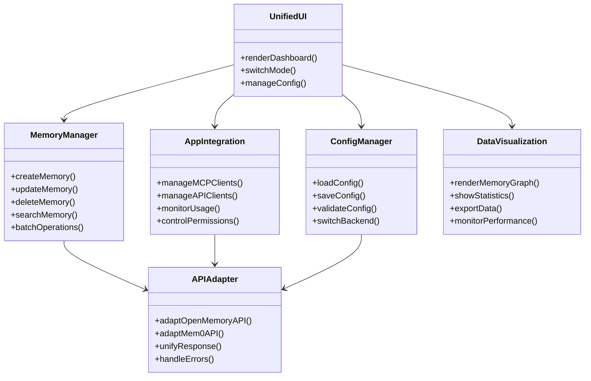
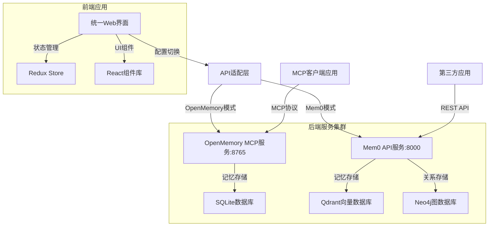
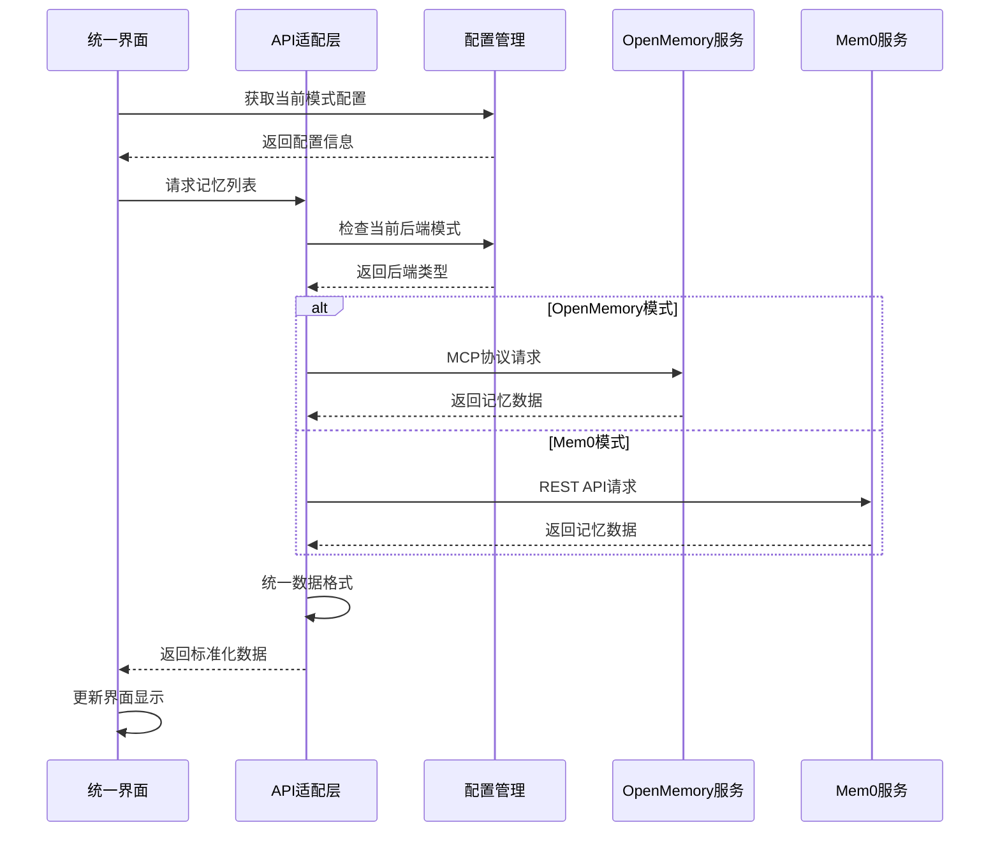

# 技术方案设计文档：OpenMemory-UI改造为Mem0统一管理界面

## 文档信息
- 作者：Kiro AI Assistant
- 版本：v1.0
- 日期：2025-01-27
- 状态：草稿
- 架构类型：非GBF框架 - 版本：Next.js 15 + FastAPI

# 一、名词解释

| 术语 | 解释 |
|------|------|
| OpenMemory | 基于MCP协议的个人记忆层服务，提供记忆管理和应用集成功能 |
| Mem0 | 完整的AI记忆层平台，包含API服务、图数据库、向量数据库等企业级功能 |
| MCP | Model Context Protocol，用于AI应用与记忆服务通信的协议 |
| 记忆实体 | 存储在系统中的结构化记忆数据，包含内容、元数据、关联关系等 |
| 应用集成 | 第三方应用通过API或MCP协议接入记忆系统的机制 |
| 向量存储 | 用于存储和检索记忆向量表示的数据库系统（如Qdrant） |
| 图数据库 | 用于存储记忆间关联关系的图形数据库（如Neo4j） |
| 统一管理界面 | 能够同时管理OpenMemory和Mem0功能的Web界面 |
| API适配层 | 用于统一不同后端服务API接口的中间层 |
| 配置化架构 | 通过配置文件控制功能模块启用/禁用的架构模式 |

# 二、功能模块

## 核心功能

### 2.1 记忆管理模块
- **OpenMemory模式**：基于MCP协议的记忆CRUD操作
- **Mem0模式**：基于REST API的企业级记忆管理
- **统一接口**：提供一致的记忆操作体验
- **批量操作**：支持批量创建、更新、删除记忆
- **记忆分类**：支持自定义分类和标签管理

### 2.2 应用集成管理
- **MCP客户端管理**：管理基于MCP协议的应用连接
- **API客户端管理**：管理基于REST API的应用集成
- **权限控制**：应用级别的访问权限管理
- **使用统计**：应用使用情况和性能监控

### 2.3 配置管理系统
- **双模式配置**：同时支持OpenMemory和Mem0配置
- **动态切换**：运行时切换不同的后端服务
- **配置验证**：配置项的格式验证和依赖检查
- **环境管理**：开发、测试、生产环境配置管理

### 2.4 数据可视化
- **记忆关系图**：基于图数据库的记忆关联可视化
- **使用统计图表**：记忆创建、访问、更新的统计图表
- **性能监控**：系统性能指标的实时监控
- **导出功能**：支持多种格式的数据导出

## 功能模块关系



# 三、应用调用关系

## 系统架构图



## 时序图



# 四、详细方案设计

## 架构选型

本方案采用**前后端分离架构**，前端使用Next.js 15构建统一管理界面，后端通过API适配层统一不同服务的接口。

### 分层架构说明

#### 前端分层架构
```
- **Presentation层**：React组件和页面，负责用户界面展示
- **State Management层**：Redux状态管理，统一管理应用状态
- **Service层**：API调用和业务逻辑处理
- **Adapter层**：API适配和数据转换
- **Utils层**：工具函数和通用逻辑
```

#### 后端服务架构
```
- **Gateway层**：API网关，统一入口和路由
- **Adapter层**：协议适配，统一不同服务的接口
- **Service层**：业务逻辑处理
- **Storage层**：数据存储和持久化
```

### 数据模型设计

#### 统一数据模型
```typescript
// 统一记忆数据模型
interface UnifiedMemory {
  id: string;
  content: string;
  metadata: Record<string, any>;
  user_id?: string;
  agent_id?: string;
  run_id?: string;
  created_at: string;
  updated_at: string;
  source: 'openmemory' | 'mem0';
  category?: string;
  tags?: string[];
}

// 统一应用数据模型
interface UnifiedApp {
  id: string;
  name: string;
  type: 'mcp' | 'api';
  status: 'active' | 'inactive';
  config: Record<string, any>;
  statistics: {
    memory_count: number;
    last_access: string;
    access_count: number;
  };
}

// 统一配置数据模型
interface UnifiedConfig {
  mode: 'openmemory' | 'mem0' | 'hybrid';
  openmemory: OpenMemoryConfig;
  mem0: Mem0Config;
  ui: UIConfig;
}
```

## API适配层设计

### 核心适配器实现

#### MemoryAdapter接口
```typescript
interface MemoryAdapter {
  // 基础CRUD操作
  createMemory(data: CreateMemoryRequest): Promise<UnifiedMemory>;
  getMemory(id: string): Promise<UnifiedMemory>;
  updateMemory(id: string, data: UpdateMemoryRequest): Promise<UnifiedMemory>;
  deleteMemory(id: string): Promise<void>;
  
  // 查询操作
  listMemories(filters: MemoryFilters): Promise<UnifiedMemory[]>;
  searchMemories(query: SearchRequest): Promise<UnifiedMemory[]>;
  
  // 批量操作
  batchCreate(memories: CreateMemoryRequest[]): Promise<UnifiedMemory[]>;
  batchUpdate(updates: BatchUpdateRequest[]): Promise<UnifiedMemory[]>;
  batchDelete(ids: string[]): Promise<void>;
}
```

#### OpenMemoryAdapter实现
```typescript
class OpenMemoryAdapter implements MemoryAdapter {
  private mcpClient: MCPClient;
  
  constructor(config: OpenMemoryConfig) {
    this.mcpClient = new MCPClient(config);
  }
  
  async createMemory(data: CreateMemoryRequest): Promise<UnifiedMemory> {
    // 转换为MCP协议格式
    const mcpRequest = this.transformToMCPFormat(data);
    const response = await this.mcpClient.call('create_memory', mcpRequest);
    return this.transformFromMCPFormat(response);
  }
  
  // 其他方法实现...
}
```

#### Mem0Adapter实现
```typescript
class Mem0Adapter implements MemoryAdapter {
  private apiClient: AxiosInstance;
  
  constructor(config: Mem0Config) {
    this.apiClient = axios.create({
      baseURL: config.apiUrl,
      headers: { 'Authorization': `Bearer ${config.apiKey}` }
    });
  }
  
  async createMemory(data: CreateMemoryRequest): Promise<UnifiedMemory> {
    // 转换为Mem0 API格式
    const apiRequest = this.transformToMem0Format(data);
    const response = await this.apiClient.post('/v1/memories/', apiRequest);
    return this.transformFromMem0Format(response.data);
  }
  
  // 其他方法实现...
}
```

### 适配器工厂

```typescript
class AdapterFactory {
  static createMemoryAdapter(config: UnifiedConfig): MemoryAdapter {
    switch (config.mode) {
      case 'openmemory':
        return new OpenMemoryAdapter(config.openmemory);
      case 'mem0':
        return new Mem0Adapter(config.mem0);
      case 'hybrid':
        return new HybridAdapter(config);
      default:
        throw new Error(`Unsupported mode: ${config.mode}`);
    }
  }
}
```

## 前端组件改造

### 配置管理组件改造

#### 模式切换组件
```typescript
// components/ModeSwitch.tsx
const ModeSwitch: React.FC = () => {
  const dispatch = useAppDispatch();
  const currentMode = useAppSelector(state => state.config.mode);
  
  const handleModeChange = async (mode: 'openmemory' | 'mem0') => {
    dispatch(setLoading(true));
    try {
      await dispatch(switchMode(mode));
      // 重新初始化适配器
      await dispatch(initializeAdapter());
      toast.success(`已切换到${mode}模式`);
    } catch (error) {
      toast.error('模式切换失败');
    } finally {
      dispatch(setLoading(false));
    }
  };
  
  return (
    <div className="mode-switch">
      <RadioGroup value={currentMode} onValueChange={handleModeChange}>
        <div className="flex items-center space-x-2">
          <RadioGroupItem value="openmemory" id="openmemory" />
          <Label htmlFor="openmemory">OpenMemory模式</Label>
        </div>
        <div className="flex items-center space-x-2">
          <RadioGroupItem value="mem0" id="mem0" />
          <Label htmlFor="mem0">Mem0模式</Label>
        </div>
      </RadioGroup>
    </div>
  );
};
```

#### 统一配置表单
```typescript
// components/UnifiedConfigForm.tsx
const UnifiedConfigForm: React.FC = () => {
  const config = useAppSelector(state => state.config);
  const dispatch = useAppDispatch();
  
  const form = useForm<UnifiedConfig>({
    resolver: zodResolver(unifiedConfigSchema),
    defaultValues: config
  });
  
  const onSubmit = async (data: UnifiedConfig) => {
    try {
      await dispatch(updateConfig(data));
      toast.success('配置保存成功');
    } catch (error) {
      toast.error('配置保存失败');
    }
  };
  
  return (
    <Form {...form}>
      <form onSubmit={form.handleSubmit(onSubmit)}>
        <Tabs value={config.mode}>
          <TabsList>
            <TabsTrigger value="openmemory">OpenMemory配置</TabsTrigger>
            <TabsTrigger value="mem0">Mem0配置</TabsTrigger>
          </TabsList>
          
          <TabsContent value="openmemory">
            <OpenMemoryConfigFields />
          </TabsContent>
          
          <TabsContent value="mem0">
            <Mem0ConfigFields />
          </TabsContent>
        </Tabs>
        
        <Button type="submit">保存配置</Button>
      </form>
    </Form>
  );
};
```

### 记忆管理组件增强

#### 统一记忆列表组件
```typescript
// components/UnifiedMemoryList.tsx
const UnifiedMemoryList: React.FC = () => {
  const memories = useAppSelector(state => state.memories.list);
  const currentMode = useAppSelector(state => state.config.mode);
  const dispatch = useAppDispatch();
  
  useEffect(() => {
    dispatch(fetchMemories());
  }, [currentMode, dispatch]);
  
  const handleBatchOperation = async (
    operation: 'delete' | 'archive' | 'activate',
    selectedIds: string[]
  ) => {
    try {
      await dispatch(batchUpdateMemories({ operation, ids: selectedIds }));
      toast.success(`批量${operation}操作成功`);
    } catch (error) {
      toast.error(`批量${operation}操作失败`);
    }
  };
  
  return (
    <div className="memory-list">
      <div className="list-header">
        <div className="mode-indicator">
          当前模式: {currentMode === 'openmemory' ? 'OpenMemory' : 'Mem0'}
        </div>
        <BatchOperationToolbar onBatchOperation={handleBatchOperation} />
      </div>
      
      <DataTable
        columns={memoryColumns}
        data={memories}
        enableSelection
        enableFiltering
        enableSorting
      />
    </div>
  );
};
```

### 应用集成管理增强

#### 统一应用管理组件
```typescript
// components/UnifiedAppManager.tsx
const UnifiedAppManager: React.FC = () => {
  const apps = useAppSelector(state => state.apps.list);
  const currentMode = useAppSelector(state => state.config.mode);
  
  const renderAppCard = (app: UnifiedApp) => (
    <Card key={app.id} className="app-card">
      <CardHeader>
        <div className="flex items-center justify-between">
          <CardTitle>{app.name}</CardTitle>
          <Badge variant={app.type === 'mcp' ? 'default' : 'secondary'}>
            {app.type.toUpperCase()}
          </Badge>
        </div>
      </CardHeader>
      
      <CardContent>
        <div className="app-stats">
          <div>记忆数量: {app.statistics.memory_count}</div>
          <div>最后访问: {formatDate(app.statistics.last_access)}</div>
          <div>访问次数: {app.statistics.access_count}</div>
        </div>
        
        <div className="app-actions">
          <Button
            variant={app.status === 'active' ? 'destructive' : 'default'}
            onClick={() => toggleAppStatus(app.id)}
          >
            {app.status === 'active' ? '禁用' : '启用'}
          </Button>
          <Button variant="outline" onClick={() => viewAppDetails(app.id)}>
            详情
          </Button>
        </div>
      </CardContent>
    </Card>
  );
  
  return (
    <div className="app-manager">
      <div className="manager-header">
        <h2>应用集成管理</h2>
        <div className="mode-info">
          {currentMode === 'openmemory' ? 'MCP协议应用' : 'REST API应用'}
        </div>
      </div>
      
      <div className="app-grid">
        {apps.map(renderAppCard)}
      </div>
    </div>
  );
};
```

## 状态管理改造

### Redux Store结构扩展

```typescript
// store/types.ts
interface RootState {
  config: ConfigState;
  memories: MemoriesState;
  apps: AppsState;
  ui: UIState;
  adapter: AdapterState;
}

interface ConfigState {
  mode: 'openmemory' | 'mem0' | 'hybrid';
  openmemory: OpenMemoryConfig;
  mem0: Mem0Config;
  ui: UIConfig;
  isLoading: boolean;
  error: string | null;
}

interface AdapterState {
  currentAdapter: MemoryAdapter | null;
  isInitialized: boolean;
  supportedFeatures: string[];
  connectionStatus: 'connected' | 'disconnected' | 'error';
}
```

### 配置管理Slice

```typescript
// store/configSlice.ts
const configSlice = createSlice({
  name: 'config',
  initialState,
  reducers: {
    setMode: (state, action: PayloadAction<'openmemory' | 'mem0'>) => {
      state.mode = action.payload;
    },
    updateOpenMemoryConfig: (state, action: PayloadAction<Partial<OpenMemoryConfig>>) => {
      state.openmemory = { ...state.openmemory, ...action.payload };
    },
    updateMem0Config: (state, action: PayloadAction<Partial<Mem0Config>>) => {
      state.mem0 = { ...state.mem0, ...action.payload };
    },
  },
  extraReducers: (builder) => {
    builder
      .addCase(switchMode.pending, (state) => {
        state.isLoading = true;
        state.error = null;
      })
      .addCase(switchMode.fulfilled, (state, action) => {
        state.mode = action.payload;
        state.isLoading = false;
      })
      .addCase(switchMode.rejected, (state, action) => {
        state.isLoading = false;
        state.error = action.error.message || '模式切换失败';
      });
  },
});
```

### 适配器管理Slice

```typescript
// store/adapterSlice.ts
const adapterSlice = createSlice({
  name: 'adapter',
  initialState,
  reducers: {
    setAdapter: (state, action: PayloadAction<MemoryAdapter>) => {
      state.currentAdapter = action.payload;
      state.isInitialized = true;
    },
    setConnectionStatus: (state, action: PayloadAction<'connected' | 'disconnected' | 'error'>) => {
      state.connectionStatus = action.payload;
    },
    setSupportedFeatures: (state, action: PayloadAction<string[]>) => {
      state.supportedFeatures = action.payload;
    },
  },
});
```

## 数据库变更

### 配置存储表设计

#### 表名：unified_config
| 字段名 | 数据类型 | 是否为空 | 主键 | 注释 |
|-------|---------|---------|------|------|
| id | varchar(50) | 否 | 是 | 配置ID |
| mode | varchar(20) | 否 | 否 | 当前模式(openmemory/mem0/hybrid) |
| openmemory_config | text | 是 | 否 | OpenMemory配置JSON |
| mem0_config | text | 是 | 否 | Mem0配置JSON |
| ui_config | text | 是 | 否 | UI配置JSON |
| created_at | timestamp | 否 | 否 | 创建时间 |
| updated_at | timestamp | 否 | 否 | 更新时间 |

### 应用集成表设计

#### 表名：unified_apps
| 字段名 | 数据类型 | 是否为空 | 主键 | 注释 |
|-------|---------|---------|------|------|
| id | varchar(50) | 否 | 是 | 应用ID |
| name | varchar(100) | 否 | 否 | 应用名称 |
| type | varchar(10) | 否 | 否 | 应用类型(mcp/api) |
| status | varchar(20) | 否 | 否 | 应用状态 |
| config | text | 是 | 否 | 应用配置JSON |
| statistics | text | 是 | 否 | 使用统计JSON |
| created_at | timestamp | 否 | 否 | 创建时间 |
| updated_at | timestamp | 否 | 否 | 更新时间 |

### 索引设计
| 索引名 | 字段 | 索引类型 | 说明 |
|-------|------|---------|------|
| idx_config_mode | mode | 普通 | 配置模式查询索引 |
| idx_apps_type_status | type, status | 普通 | 应用类型和状态复合索引 |
| idx_apps_name | name | 普通 | 应用名称查询索引 |

## 接口文档变更

### 统一配置接口

#### 接口名：获取统一配置
- 接口路径：GET /api/config/unified
- 变更类型：新增
- 变更说明：新增统一配置获取接口，支持多模式配置

**返回结果**：
```json
{
  "code": 200,
  "message": "success",
  "data": {
    "mode": "mem0",
    "openmemory": {
      "mcp_server_url": "http://localhost:8765",
      "api_key": "***"
    },
    "mem0": {
      "api_url": "http://localhost:8000",
      "api_key": "***"
    },
    "ui": {
      "theme": "dark",
      "language": "zh-CN"
    }
  }
}
```

#### 接口名：更新统一配置
- 接口路径：PUT /api/config/unified
- 变更类型：新增
- 变更说明：新增统一配置更新接口

### 模式切换接口

#### 接口名：切换运行模式
- 接口路径：POST /api/config/switch-mode
- 变更类型：新增
- 变更说明：新增模式切换接口，支持运行时切换后端服务

**请求参数**：
```json
{
  "mode": "mem0",
  "config": {
    "api_url": "http://localhost:8000",
    "api_key": "your-api-key"
  }
}
```

## 配置变更

### 环境变量配置
- 配置名：UNIFIED_MODE
- 配置值：openmemory|mem0|hybrid
- 说明：默认运行模式

- 配置名：OPENMEMORY_MCP_URL
- 配置值：http://localhost:8765
- 说明：OpenMemory MCP服务地址

- 配置名：MEM0_API_URL
- 配置值：http://localhost:8000
- 说明：Mem0 API服务地址

### Docker Compose配置更新
```yaml
# docker-compose.yml
services:
  unified-ui:
    build: ./openmemory/ui
    ports:
      - "3000:3000"
    environment:
      - UNIFIED_MODE=hybrid
      - OPENMEMORY_MCP_URL=http://openmemory-api:8765
      - MEM0_API_URL=http://mem0-api:8000
    depends_on:
      - openmemory-api
      - mem0-api
  
  openmemory-api:
    build: ./openmemory/api
    ports:
      - "8765:8765"
    
  mem0-api:
    build: ./server
    ports:
      - "8000:8000"
    depends_on:
      - qdrant
      - neo4j
```

## 非功能性需求

### 性能需求
- 界面响应时间：< 200ms
- API调用响应时间：< 1s
- 大量记忆列表加载：支持虚拟滚动，单页最多1000条
- 模式切换时间：< 3s

### 可用性需求
- 系统可用率：99.9%
- 故障恢复时间：< 5分钟
- 支持优雅降级：单一后端服务故障时仍可使用另一服务
- 离线缓存：支持基本功能的离线使用

### 扩展性需求
- 支持新增其他记忆服务适配器
- 支持插件化的功能模块
- 支持多租户架构扩展
- 支持水平扩展部署

## 兼容性与平滑迁移方案

### 兼容性问题
1. **API接口差异**：OpenMemory使用MCP协议，Mem0使用REST API
2. **数据格式差异**：两个系统的记忆数据结构不完全一致
3. **功能特性差异**：Mem0支持更多企业级功能
4. **配置格式差异**：配置文件结构和参数名称不同

### 平滑迁移方案

#### 第一阶段：基础适配（1-2周）
1. 实现API适配层，统一接口调用
2. 完成数据模型转换和格式统一
3. 实现基础的模式切换功能
4. 保持现有功能完全可用

#### 第二阶段：功能增强（2-3周）
1. 增加Mem0特有功能的UI支持
2. 实现批量操作和高级搜索
3. 完善配置管理和验证机制
4. 添加数据可视化功能

#### 第三阶段：优化完善（1-2周）
1. 性能优化和用户体验提升
2. 完善错误处理和异常恢复
3. 添加监控和日志功能
4. 完成文档和测试

#### 数据迁移策略
```typescript
// 数据迁移工具
class DataMigrationTool {
  async migrateFromOpenMemoryToMem0() {
    // 1. 导出OpenMemory数据
    const openMemoryData = await this.exportOpenMemoryData();
    
    // 2. 转换数据格式
    const convertedData = this.convertDataFormat(openMemoryData);
    
    // 3. 导入到Mem0
    await this.importToMem0(convertedData);
    
    // 4. 验证数据完整性
    await this.validateMigration();
  }
  
  async rollbackMigration() {
    // 回滚机制实现
  }
}
```

## 风险与应对措施

| 风险 | 可能性 | 影响 | 应对措施 |
|------|-------|------|---------|
| API兼容性问题 | 中 | 高 | 充分测试API适配层，建立完善的错误处理机制 |
| 数据迁移失败 | 低 | 高 | 实现数据备份和回滚机制，分批次迁移 |
| 性能下降 | 中 | 中 | 实现缓存机制，优化API调用，使用虚拟滚动 |
| 用户体验不一致 | 中 | 中 | 统一UI组件库，保持交互模式一致 |
| 配置复杂度增加 | 高 | 低 | 提供配置向导，简化配置流程 |
| 维护成本增加 | 高 | 中 | 模块化设计，完善文档和测试覆盖 |

### 风险缓解策略
1. **渐进式改造**：分阶段实施，每个阶段都保证系统可用
2. **充分测试**：建立完整的测试体系，包括单元测试、集成测试、端到端测试
3. **监控告警**：实现全面的监控和告警机制
4. **文档完善**：提供详细的使用文档和故障排除指南
5. **用户培训**：为用户提供新功能的培训和支持

## 实施计划

### 开发里程碑
- **Week 1-2**：API适配层开发和基础功能改造
- **Week 3-4**：UI组件改造和状态管理重构
- **Week 5-6**：功能增强和数据可视化
- **Week 7**：测试、优化和文档完善

### 验收标准
1. 支持OpenMemory和Mem0两种模式的无缝切换
2. 所有现有功能在两种模式下都能正常工作
3. 新增功能（批量操作、数据可视化等）正常可用
4. 性能指标满足要求
5. 通过完整的测试验证

通过以上技术方案，我们将成功地将OpenMemory UI改造为能够统一管理OpenMemory和Mem0的综合管理界面，在保持现有功能完整性的同时，为用户提供更强大和灵活的记忆管理能力。