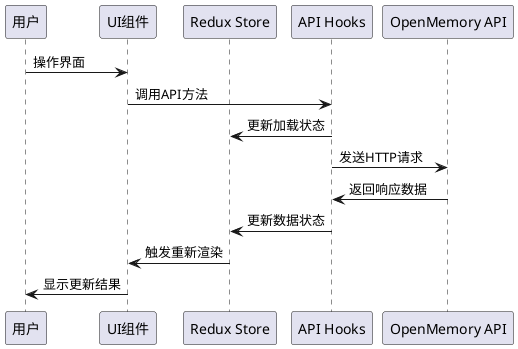

# OpenMemory UI项目梳理文档

## 功能概述
OpenMemory UI是一个基于Next.js 15的现代化Web应用程序，为OpenMemory个人记忆层提供可视化管理界面。该应用允许用户管理AI记忆、查看应用集成状态、配置系统设置，并提供完整的记忆生命周期管理功能。

## 技术架构

### 核心技术栈
- **前端框架**: Next.js 15 (App Router)
- **UI组件库**: Radix UI + Tailwind CSS
- **状态管理**: Redux Toolkit
- **HTTP客户端**: Axios
- **表单处理**: React Hook Form + Zod
- **图表库**: Recharts
- **图标库**: Lucide React + React Icons

### 项目结构
```
openmemory/ui/
├── app/                    # Next.js App Router页面
│   ├── layout.tsx         # 根布局组件
│   ├── page.tsx           # 首页(Dashboard)
│   ├── providers.tsx      # Redux Provider配置
│   ├── memories/          # 记忆管理页面
│   ├── apps/             # 应用管理页面
│   └── settings/         # 设置页面
├── components/            # 可复用组件
│   ├── ui/               # 基础UI组件(shadcn/ui)
│   ├── dashboard/        # 仪表板组件
│   └── shared/           # 共享业务组件
├── hooks/                # 自定义Hooks
├── store/                # Redux状态管理
├── lib/                  # 工具函数
└── styles/               # 样式文件
```

## 核心业务模块

### 1. 记忆管理模块 (Memories)

#### 入口组件
`app/memories/page.tsx` → `MemoriesSection` → `useMemoriesApi`

#### 组件调用树
```
MemoriesPage
├── MemoryFilters (记忆筛选器)
│   ├── 搜索框
│   ├── 应用筛选
│   ├── 分类筛选
│   └── 排序选项
├── MemoriesSection (记忆列表区域)
│   ├── MemoryTable (记忆表格)
│   ├── 分页控件
│   └── 批量操作按钮
└── UpdateMemory (记忆编辑对话框)
```

#### 详细业务流程
1. **记忆数据获取**
   - 通过`useMemoriesApi.fetchMemories()`调用API
   - 支持分页、搜索、筛选、排序参数
   - 数据适配：将API返回的`content`字段映射为`memory`字段
   - 状态更新：通过Redux的`setMemoriesSuccess`更新全局状态

2. **记忆筛选与搜索**
   - 实时搜索：输入框变化触发API调用
   - 多维度筛选：按应用、分类、状态筛选
   - URL同步：筛选条件同步到URL参数

3. **记忆状态管理**
   - 支持状态：active(活跃)、paused(暂停)、archived(归档)、deleted(删除)
   - 批量操作：支持批量暂停、激活、归档记忆
   - 状态同步：本地状态与服务端状态保持一致

4. **记忆编辑功能**
   - 内容编辑：支持直接编辑记忆内容
   - 实时预览：编辑时提供实时预览
   - 自动保存：编辑完成后自动保存到服务端

#### 关键业务规则
- 记忆ID必须唯一，用于标识和操作
- 归档的记忆不会在默认列表中显示
- 删除操作需要用户确认
- 批量操作最多支持选择所有当前页面的记忆

#### 数据流转
- **输入**: 用户搜索条件、筛选参数、分页参数
- **处理**: API调用 → 数据适配 → Redux状态更新 → UI重新渲染
- **输出**: 格式化的记忆列表、分页信息、操作反馈

### 2. 应用管理模块 (Apps)

#### 入口组件
`app/apps/page.tsx` → `AppGrid` → `useAppsApi`

#### 组件调用树
```
AppsPage
├── AppFilters (应用筛选器)
│   ├── 搜索框
│   ├── 状态筛选(活跃/非活跃)
│   └── 排序选项
├── AppGrid (应用网格)
│   ├── AppCard[] (应用卡片列表)
│   └── 分页控件
└── AppDetailDialog (应用详情对话框)
    ├── 应用统计信息
    ├── 创建的记忆列表
    └── 访问的记忆列表
```

#### 详细业务流程
1. **应用列表获取**
   - 调用`useAppsApi.fetchApps()`获取应用列表
   - 支持按名称搜索、状态筛选、多种排序方式
   - 显示应用基本信息：名称、图标、记忆数量、访问次数

2. **应用详情查看**
   - 点击应用卡片打开详情对话框
   - 获取应用详细统计：总记忆数、访问次数、首次/最后访问时间
   - 分页显示应用创建的记忆和访问的记忆

3. **应用状态管理**
   - 支持启用/禁用应用
   - 状态变更实时同步到服务端
   - 影响记忆的创建和访问权限

#### 关键业务规则
- 应用状态影响记忆的可访问性
- 禁用的应用不能创建新记忆
- 应用统计数据实时计算
- 应用图标根据应用名称动态匹配

### 3. 配置管理模块 (Settings)

#### 入口组件
`app/settings/page.tsx` → `FormView`/`JsonEditor` → `useConfig`

#### 组件调用树
```
SettingsPage
├── Tabs (视图切换)
│   ├── FormView (表单视图)
│   │   ├── OpenMemory配置表单
│   │   └── Mem0配置表单
│   └── JsonEditor (JSON编辑器)
├── 保存按钮
└── 重置按钮
```

#### 详细业务流程
1. **配置加载**
   - 页面加载时自动获取当前配置
   - 支持OpenMemory和Mem0两套配置
   - 配置数据存储在Redux中

2. **配置编辑**
   - 表单视图：结构化的配置表单
   - JSON视图：直接编辑JSON配置
   - 实时验证：配置格式和必填项验证

3. **配置保存**
   - 统一保存接口处理两套配置
   - 保存成功后更新Redux状态
   - 提供保存状态反馈

4. **配置重置**
   - 重置为系统默认配置
   - 需要用户确认操作
   - 重置后重新加载配置

#### 关键业务规则
- 配置变更需要保存才能生效
- 重置操作不可逆，需要用户确认
- JSON编辑器需要验证JSON格式
- API密钥等敏感信息需要安全处理

### 4. 仪表板模块 (Dashboard)

#### 入口组件
`app/page.tsx` → `Stats` + `Install` + `MemoriesSection`

#### 组件调用树
```
DashboardPage
├── Install (安装指南)
│   └── MCP客户端安装说明
├── Stats (统计信息)
│   ├── 总记忆数
│   ├── 连接应用数
│   └── 应用图标展示
├── MemoryFilters (记忆筛选)
└── MemoriesSection (记忆列表)
```

#### 详细业务流程
1. **统计数据展示**
   - 显示总记忆数量
   - 显示连接的应用数量
   - 展示最近活跃的应用图标

2. **快速操作入口**
   - 提供记忆筛选功能
   - 显示最新的记忆列表
   - 支持快速创建记忆

## 状态管理架构

### Redux Store结构
```typescript
RootState {
  memories: MemoriesState,    // 记忆数据和状态
  apps: AppsState,           // 应用数据和筛选状态
  profile: ProfileState,     // 用户配置信息
  ui: UIState,              // UI状态(对话框等)
  filters: FiltersState,     // 筛选条件状态
  config: ConfigState       // 系统配置状态
}
```

### 关键Slice分析

#### MemoriesSlice
- **状态**: 记忆列表、选中记忆、访问日志、相关记忆
- **操作**: 加载记忆、选择记忆、批量操作、状态更新
- **异步处理**: 通过hooks处理API调用，slice只处理同步状态更新

#### AppsSlice  
- **状态**: 应用列表、筛选条件、选中应用详情
- **操作**: 加载应用、筛选排序、应用详情管理
- **嵌套状态**: 应用详情包含创建记忆和访问记忆的分页状态

## API交互层

### 核心Hooks

#### useMemoriesApi
- **职责**: 记忆相关的所有API操作
- **方法**: 获取、创建、更新、删除记忆，获取访问日志和相关记忆
- **状态管理**: 结合Redux进行状态同步
- **错误处理**: 统一的错误处理和用户反馈

#### useAppsApi
- **职责**: 应用相关的API操作  
- **方法**: 获取应用列表、应用详情、应用记忆数据
- **筛选支持**: 支持复杂的筛选和排序参数
- **分页处理**: 内置分页逻辑

#### useConfig
- **职责**: 系统配置的API操作
- **方法**: 获取、保存、重置配置
- **配置类型**: 支持OpenMemory和Mem0两套配置
- **验证机制**: 配置格式验证和错误处理

### API适配层
- **数据转换**: API响应数据到前端数据模型的转换
- **错误统一**: 统一的错误格式和处理机制
- **加载状态**: 统一的加载状态管理
- **缓存策略**: 基于Redux的数据缓存

## UI组件体系

### 设计系统
- **基础组件**: 基于Radix UI的无样式组件
- **样式系统**: Tailwind CSS + CSS变量
- **主题支持**: 深色主题为主，支持主题切换
- **响应式**: 移动端适配和响应式布局

### 组件分层
1. **基础UI组件** (`components/ui/`): 按钮、输入框、对话框等
2. **业务组件** (`components/shared/`): 记忆卡片、应用卡片等
3. **页面组件** (`app/*/components/`): 页面特定的组件
4. **布局组件**: 导航栏、侧边栏、页面布局

### 交互模式
- **即时反馈**: 操作后立即显示结果
- **乐观更新**: 先更新UI，后同步服务端
- **错误恢复**: 操作失败时回滚UI状态
- **加载状态**: 统一的加载指示器

## 扩展点/分支逻辑

### 记忆状态分支
- **活跃记忆**: 正常显示和搜索
- **暂停记忆**: 显示但不参与AI推理
- **归档记忆**: 默认隐藏，可通过筛选显示
- **删除记忆**: 软删除，不在UI中显示

### 应用集成分支
- **活跃应用**: 可以创建和访问记忆
- **禁用应用**: 只能查看历史记忆，不能创建新记忆
- **未知应用**: 显示默认图标和名称

### 配置模式分支
- **表单模式**: 结构化配置编辑
- **JSON模式**: 高级用户直接编辑JSON
- **默认配置**: 系统预设的默认值

## 外部依赖

### API服务依赖
- **OpenMemory API**: 核心的记忆管理API服务
- **认证服务**: 基于用户ID的简单认证
- **文件服务**: 头像和应用图标服务

### 第三方服务
- **OpenAI API**: LLM服务提供商
- **向量数据库**: 记忆的向量存储和检索
- **MCP协议**: 与各种客户端的集成协议

## 注意事项

### 性能优化
- **虚拟滚动**: 大量记忆列表的性能优化
- **分页加载**: 避免一次性加载过多数据
- **图片懒加载**: 应用图标的懒加载
- **状态缓存**: Redux状态的合理缓存策略

### 安全考虑
- **API密钥**: 敏感配置信息的安全处理
- **用户隔离**: 基于用户ID的数据隔离
- **输入验证**: 前端输入的格式验证
- **XSS防护**: 记忆内容的安全渲染

### 用户体验
- **响应式设计**: 适配不同屏幕尺寸
- **无障碍支持**: 键盘导航和屏幕阅读器支持
- **国际化**: 预留多语言支持的架构
- **离线处理**: 网络异常时的优雅降级

### 开发维护
- **类型安全**: 完整的TypeScript类型定义
- **代码规范**: ESLint和Prettier的代码格式化
- **组件复用**: 高度可复用的组件设计
- **测试覆盖**: 关键业务逻辑的测试覆盖

## 系统交互图



该项目采用现代化的React生态系统，通过清晰的分层架构和状态管理，为OpenMemory提供了功能完整、用户体验良好的Web管理界面。